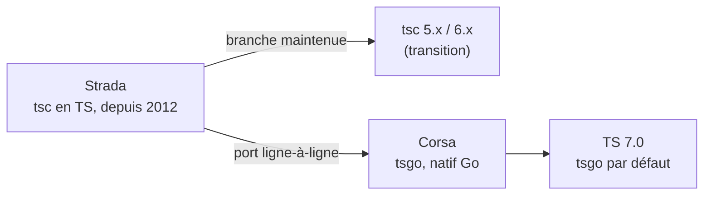

# tsgo : 10x plus rapide, mais à quel prix ?

<div class="muted">TypeScript 7, le port natif en Go (« Corsa »)</div>

<div class="stat-row">
  <BigStat from="78s" to="7.5s" label="vscode · type-check · benchmark officiel Microsoft" />
</div>
<!-- source: https://devblogs.microsoft.com/typescript/typescript-native-port/ -->

<div class="rule"></div>

Beta : **21 avril 2026** · stable visé Q2 2026
<!-- source: https://devblogs.microsoft.com/typescript/announcing-typescript-7-0-beta/ -->

Lilian Saget-Lethias · LinkedIn `lsagetlethias`

<div class="ai-credit">Présentation préparée en collaboration avec Claude Code (Opus 4.8).</div>

<!--
**À dire**
- Ouvrir direct, pas d'intro perso longue : le titre EST l'accroche.
- La punchline d'ouverture, le gros chiffre du talk : « 78 secondes à 7 secondes et demi. C'est vscode. C'est officiel. »
- Enchaîner sur le quoi, en une phrase : « TypeScript 7, le port natif en Go de tsc. Nom de code Corsa, binaire tsgo. Beta le 21 avril, stable visé Q2 2026. »
- Poser le titre comme une vraie question, pas une formule : « 10x plus rapide, ça c'est le titre partout. Ce soir, l'objectif c'est de répondre à la deuxième moitié : à quel prix ? »
- Attribution Claude Code, factuelle, une seule phrase, sans s'excuser ni broder : « Cette présentation a été préparée en collaboration avec Claude Code, Opus 4.8. » Pointer la ligne en bas, puis avancer.
- Une ligne de qui-on-est maximum, elle peut même se fondre dans le bonsoir : « Lilian, à retrouver sur LinkedIn lsagetlethias. »

**Timing**
- Cette slide : ~40 à 50s. C'est le hook, pas un chapitre. Elle fait partie du Bloc 1 (Hook + chiffres) qui tient en 1:30 cumulé avec la slide suivante. Ne pas traîner ici : le wow, c'est la démo, pas l'intro.

**À faire**
- Rester sur les slides, rien à lancer au terminal sur cette slide.
- Le BigStat 78s vers 7.5s est animé / mis en avant à l'écran : le laisser respirer une seconde au moment de l'annonce du chiffre, ne pas parler par-dessus l'effet.
- D'un geste, montrer la ligne d'attribution Claude Code en bas au moment de la dire, puis la lâcher tout de suite.
- Vérifier d'un coup d'oeil que les 3 terminaux sont bien cd dans les bons cwd et que le slide dev tourne en parallèle (utile dès la démo 1).

**Transition**
- « Ce 78 vers 7,5, c'est vscode, 1,5 million de lignes. Et ce n'est pas un cas isolé : regardez. » Cliquer vers la slide « Les chiffres qui font le buzz » (Sentry 133 vers 16, Playwright 11.1 vers 1.1, ~10x, mémoire divisée par 2).

**Pièges**
- Ne pas lire la slide mot à mot, le public sait lire. On commente, on n'annonce pas un sommaire.
- Sur l'attribution : l'assumer, ne pas la transformer en disclaimer gênant et ne pas partir en méta-discussion sur l'IA. Une phrase, factuelle, et next. Si quelqu'un rebondit dessus, c'est pour la fin / le couloir, pas maintenant.
- Si une question arrive tôt « c'est prod-ready, on migre ? » : ne pas tout déballer ici, renvoyer à la fin (« j'y viens, c'est exactement le coeur du talk ») ; la réponse cadrée est en Q1 (non pour publier des libs, oui pour type-checker en local/CI en side-by-side, stable visé Q2 2026).
- Le 78s est un benchmark officiel Microsoft (devblogs, post du port natif). Si on demande la source, c'est ça ; pour la démo live on annoncera ses propres chiffres, mais ici on est sur le chiffre officiel, le dire tel quel.
- Ne pas survendre : « 10x » est le titre, le vrai retournement (le 10x sert l'outil / l'agent IA qui type-checke 40 fois par minute) arrive plus tard, le garder pour le prix n°3. Ici on pose juste la tension vitesse vs prix.
-->

---
layout: code
file: benchmarks.md
---

## Les chiffres qui font le buzz

- **vscode** (1.5M lignes) : `78s → 7.5s` <span class="muted">(~10x)</span>
- **Sentry** `133s → 16s` · **Playwright** `11.1s → 1.1s` <span class="muted">(même ordre de grandeur)</span>
<div class="src">source : Microsoft DevBlogs, port natif TS</div>
<!-- source: https://devblogs.microsoft.com/typescript/typescript-native-port/ -->

<div class="rule"></div>

- Type-check **~10x**, mémoire **~÷2**
<!-- source: https://devblogs.microsoft.com/typescript/typescript-native-port/ -->

<div class="muted small">Et c'est correct : 74 diagnostics divergents sur ~20 000 cas de test.</div>
<div class="src">source : Microsoft DevBlogs, avancement déc. 2025</div>
<!-- source: https://devblogs.microsoft.com/typescript/progress-on-typescript-7-december-2025/ -->

<!--
**Rôle de cette slide.** L'ouverture vient de poser le hero (78s à 7.5s sur vscode). Ici on enfonce le clou avec les chiffres officiels, MAIS le piège classique c'est de réciter les 8 nombres comme un bulletin météo. Personne ne retiendra 8 chiffres. En faire retenir UN, et faire passer la parité comme réassurance "c'est rapide ET correct".

**À dire (le chiffre à ancrer).** « 78 secondes à 7 secondes et demi. C'est vscode, 1,5 million de lignes. C'est officiel, c'est le benchmark Microsoft. » Laisser une demi-seconde, c'est CE chiffre que la salle doit emporter ce soir.

**À dire (le reste, en survol, sans s'attarder).** « Sentry, 133 secondes à 16. Playwright, 11 à 1. Même ordre de grandeur partout : type-check à peu près 10x, et la mémoire divisée par deux. » Balancer Sentry et Playwright vite, comme une confirmation, pas comme une liste à cocher. Le message implicite : ce n'est pas un cherry-pick sur un repo, ça tient sur plusieurs gros projets.

**À dire (la mémoire, à ne pas noyer).** « Le 10x, c'est le titre ; la mémoire divisée par deux, c'est ce qui change la CI et le laptop. » C'est la deuxième chose qui mérite d'exister à l'oral, parce que le 10x impressionne mais le ÷2 mémoire est ce qui débloque des CI qui OOM aujourd'hui.

**À dire (la parité, la réassurance).** « Et c'est correct : 74 diagnostics divergents sur à peu près 20 000 cas de test. » Annoncer le chiffre BRUT, jamais en pourcentage sur scène. On donne 74 sur 20 000, on laisse la salle faire le calcul mentalement (c'est minuscule), et on n'offre pas de prise à quelqu'un qui sortirait sa calculette pour pinailler sur une décimale. Le rôle de cette ligne : couper d'avance le réflexe "ouais mais c'est rapide parce que ça vérifie moins de trucs". Non, même corpus, quasi mêmes résultats.

**Timing.** Environ 1 min sur cette slide (le bloc 1 hook + chiffres fait 1:30 au total, le hero a déjà mangé ~30s). Rester rapide, c'est de l'autorité posée, pas un cours.

**À faire.** Rester sur les slides, aucun terminal ici (le terminal arrive à la démo 1). Pointer du doigt la ligne vscode `78s → 7.5s` au moment de prononcer le chiffre d'ancrage, puis la ligne grise du bas (les 74 diagnostics) pour la réassurance parité. Ne pas lire les sources à voix haute, elles sont là pour la crédibilité, pas pour le public.

**Transition.** « Ces chiffres, on peut les croire sur parole, ou on les montre en live. Allez, au terminal. » Enchaîner sur la slide démo (« Place au live » puis « Le mur de la compilation »). L'idée de bascule : les chiffres officiels sont donnés, maintenant on va les reproduire devant la salle sur vscode.

**Pièges.**
Si on demande "et sur un petit projet, ça vaut le coup ?" : c'est la Q8, à garder pour la Q&A, répondre en une phrase si vraiment poussé (« moins spectaculaire en absolu, mais la mémoire et la boucle watch/LSP gagnent quand même »), mais ne pas dévier du flux ici.
Si quelqu'un objecte sur la parité ("74 sur 20 000, c'est quoi exactement ?") : c'est la Q5. La nuance à avoir en tête : ces 74 concernent le type-check ; l'EMIT des déclarations est une surface à part, encore en preview côté tsgo, et c'est précisément pour ça qu'on fera du double-binaire plus tard. Ne pas confondre "74 diagnostics divergents" (correction du type-check) avec "l'emit n'est pas prêt" (autre sujet, slide CI). Si on le demande, le bug JSDoc `@template` est vérifié corrigé, mais ne pas l'amener de soi-même ici.
Ne PAS donner de pourcentage sur la parité, même si on le connaît (moins de 0,4 %) : le chiffre brut impressionne et ne se laisse pas piéger.
Ne pas survendre le 10x comme une garantie universelle : c'est « à peu près 10x » sur ces gros repos, bien dire « même ordre de grandeur » pour Sentry et Playwright, pas « exactement 10x partout ».
-->

---
layout: center
---

<div class="divider-kicker">DÉMO · AU TERMINAL</div>

# <span class="no-comment">Place au live</span>

<div class="muted">Trois démos : vitesse (vscode) · migration (monorepo) · CI (double-binaire).</div>

<!--
**À dire**
- "Assez de slides, on passe au concret. Tout ce qui suit, c'est en live, au terminal."
- "Trois démos, dans cet ordre : la vitesse sur vscode, la migration d'un vrai monorepo, et la CI en double-binaire."
- "Si une démo casse, pas de panique : il y a des slides Plan B en appendice avec les sorties figées. On respire, on enchaîne."

**Timing**
- 20 à 30 secondes max. C'est une slide de respiration et d'annonce, pas de contenu. Elle est déjà budgétée dans le hook (cumul visé 1:30 avant la démo 1). Ne pas s'attarder : le but est juste de poser le cadre "terminal" et de basculer.

**À faire**
- Annoncer les trois démos en les comptant sur les doigts (vitesse, migration, CI), ça rend l'arc visible.
- Vérifier d'un coup d'oeil que les 3 terminaux sont prêts et déjà cd dans les bons cwd : `demo-project-big/vscode/` (démo 1), `demo-project-small/` (démos 2 et 3), racine du repo (démo 3, le YAML). Commandes longues déjà préchargées dans l'historique shell, zéro frappe en direct.
- Terminal en gros (18pt minimum), thème clair (salle lumineuse). Notifications coupées.
- Ne PAS lancer de commande ici. C'est l'instant pour respirer, pas pour taper.

**Transition**
- "On commence par le morceau qui fait le buzz : la vitesse. time tsc contre time tsgo, sur le repo vscode." Puis bascule directe au terminal de la démo 1.

**REPÈRE MENTAL · ANTI-TUNNEL (à connaître AVANT d'entrer dans les démos, ne pas lire à voix haute)**
- Budget : ~17:30 de contenu sur un slot de 20:00, soit ~2:30 de coussin. En cas de débordement malgré tout, on coupe dans cet ordre précis (du premier au dernier sacrifié).
- Coupe n°1 (gagne ~1 min) : Bloc "Pourquoi Go". On le compresse à UNE punchline et on saute la slide Strada vers Corsa. Phrase de pont : "le détail du choix Go est dans les slides et en Q&A."
- Coupe n°2 (gagne ~1 min) : Démo 2 (migration). On ne montre QUE `baseUrl`, on saute esModuleInterop et const enum. Phrase de pont : "même histoire pour deux autres options."
- Coupe n°3 (gagne ~1 min) : Démo 3 (CI). On ne lance RIEN, on fait tout depuis la slide YAML en commentant les deux jobs. Phrase de pont : "on montre le pattern, pas la mécanique."
- Coupe n°4 (dernier recours) : Bloc AI / LSP. On saute la démo `tsgo --lsp` mais on GARDE la slide, le twist (le 10x est pour l'outil qui type-checke 40 fois par minute) et la citation Microsoft.

**RÈGLES DURES (non négociables)**
- NE JAMAIS sacrifier la Démo 1 : c'est le wow, c'est ce que la salle est venue voir.
- NE JAMAIS sacrifier le Wrap ("Lundi, 3 actions") : c'est l'action concrète, le souvenir qu'on emporte.
- En cas d'AVANCE au contraire : on développe la mention tldraw (issue #7574) en démo 2.

**Pièges**
- Le piège classique de cette slide : se mettre à parler trop longtemps "en intro" et grignoter le coussin avant même la première démo. Annonce, transition, terminal. C'est tout.
- Si l'install ou le build de la démo 1 a un souci au moment de basculer : il y a la slide "Plan B · Démo 1" avec les chiffres figés (et idéalement une capture asciinema/vidéo du run réussi à jouer). Annoncer les chiffres comme des mesures sur scène, pas comme le benchmark Microsoft.
- Question probable ici : "tout va être lancé en vrai ?" Réponse courte : oui pour tsgo (le live, c'est le wow), le tsc cold de 78s est pré-mesuré (scrollback ou capture) pour ne pas faire fixer la salle sur une barre de progression en silence.
-->

---
layout: center
---

<div class="divider-kicker">LE GAIN · LA VITESSE</div>

# <span class="no-comment">Le mur de la compilation</span>

<div class="muted"><code>time tsc --noEmit</code> &nbsp;vs&nbsp; <code>time tsgo --noEmit</code> &nbsp;·&nbsp; microsoft/vscode</div>

<!--
**À dire (ouverture)**

« Ok, assez de chiffres sur slide. Là on est sur du vrai : microsoft/vscode, 1,5 million de lignes, et on va comparer `time tsc` contre `time tsgo` en direct. »

« Et le point de départ, c'est que c'est un drop-in : même registry npm, juste un binaire en plus. »

**Timing**

Cette slide divider = 15 à 20s max. C'est juste l'annonce. Tout le poids (4 min) est dans la démo au terminal qui suit. Cumul visé en sortie de démo : 5:30.

**À faire (mise en scène, dans l'ordre)**

Basculer sur le terminal 1, déjà `cd` dans `demo-project-big/vscode/`. Terminal en gros (18pt minimum), thème clair. Les commandes longues sont déjà dans l'historique shell, zéro frappe en direct.

1. Le drop-in. Lancer `npm install -D @typescript/native-preview`. Ça rend en ~2s depuis le cache (setup.sh a déjà tout installé). Laisser respirer 2s et placer la punchline : « drop-in, même registry npm, binaire `tsgo`. »

2. La référence tsc. NE PAS faire fixer la salle sur la barre tsc de 78s en silence, c'est mortel. Deux options selon ce qui a été préparé :
   - soit on montre le scrollback / la capture du run tsc déjà mesuré en coulisse (`rm -f src/*.tsbuildinfo` puis `time npx tsc -p src/tsconfig.json --noEmit`, sortie `real 1m18s`),
   - soit on le lance en live MAIS en narrant pendant qu'il mouline (parler du codebase, du fait que c'est du Node mono-thread, etc.). Jamais de silence sur les 78s.

3. tsgo en live, c'est LE wow. Lancer `time npx tsgo -p src/tsconfig.json --noEmit`. Sortie attendue : `real 0m7.6s` (~7,5s, ~10x). Quand ça rend, SILENCE 2 secondes. On ne dit rien, on laisse la salle encaisser et réagir.

4. La mémoire, à l'oral seulement (pas de commande dans le flux nominal) : « le 10x, c'est le titre ; la mémoire divisée par deux, c'est ce qui change la CI et le laptop. » Le détail `--extendedDiagnostics` reste en Plan B, ne pas l'introduire ici.

**À dire (les phrases clés, à caler pendant la démo)**

« drop-in, même registry npm, binaire `tsgo`. »

(après les 7s de tsgo et le silence) « Voilà. Même cible, même tsconfig. 78 secondes d'un côté, 7 et demi de l'autre. »

« le 10x, c'est le titre ; la mémoire divisée par deux, c'est ce qui change la CI et le laptop. »

Annoncer toujours les chiffres comme des mesures faites sur scène, pas comme le benchmark Microsoft.

**Transition (vers Pourquoi Go)**

« Maintenant que le gain est vu, la vraie question c'est : comment ils ont fait ? Et surtout pourquoi en Go, et pas en Rust ? » On enchaîne sur la slide « Pourquoi Go ». La curiosité est gagnée précisément parce que le wow vient d'arriver, c'est pour ça que le « comment » est placé après et pas avant.

**Pièges (Plan B + ce qui peut foirer)**

Plan B prioritaire : si l'install ou le run rate, basculer sur la slide « Plan B · Démo 1 » en appendice (chiffres figés : tsc `real 1m18.4s`, tsgo `real 0m7.6s`). Idéalement, avoir une capture vidéo ou un asciinema du run réussi sous la main : c'est le SEUL moment du talk qui est irrejouable en 30s si ça plante. On joue la vidéo, on annonce les chiffres comme ses propres mesures, on enchaîne sans s'excuser.

Le gros piège technique amont : le setup de vscode (`./setup.sh`, npm ci de vscode) prend 10 à 20 min. Ça doit être fait BIEN avant de monter sur scène, idéalement en dry-run complet la veille, puis on n'y retouche plus (ne pas relancer setup.sh, ne pas bumper les versions le jour J).

Si on demande « c'est du cold ou du cache ? » : le tsc est mesuré cold (d'où le `rm -f src/*.tsbuildinfo` avant). L'assumer, c'est la comparaison honnête.

Si quelqu'un lance « et sur un petit projet ? » pendant la démo : le noter pour la Q&A (Q8), ne pas dévier du flux. Réponse courte : moins spectaculaire en absolu, mais la mémoire et la boucle de feedback (watch, LSP, agents) gagnent quand même.

Ne JAMAIS sacrifier cette démo, même en retard : c'est le wow, c'est la raison d'être du talk.
-->

---
layout: code
file: why-go.go
---

## Pourquoi Go, et pas Rust ?

Un compilateur, c'est un gros graphe d'objets qui se pointent mutuellement : un nœud connaît son parent ET ses enfants.

- Port quasi **ligne-à-ligne** du tsc existant : le codebase s'y prête
- Go gère ces **graphes cycliques** nativement (GC) ; le **borrow-checker** de Rust, lui, frictionne
- L'auteur de **SWC** a exploré un tsc en Rust, puis l'a écarté
<!-- source: https://devblogs.microsoft.com/typescript/typescript-native-port/ -->

<div class="muted small">Pas un « bootstrap » (compilo écrit dans son propre langage) : tsgo est en Go, il ne se compile pas lui-même.</div>

<!--
**À dire**

Cette slide arrive APRÈS le wow de la démo 1 : la salle vient de voir le 78s à 7.5s, donc la curiosité « mais comment ils ont fait, et pourquoi Go ? » est gagnée. On répond pendant qu'ils sont accrochés.

Phrase d'ancrage AVANT les buzzwords, c'est la règle d'or de cette slide : « Un compilateur, c'est un gros graphe d'objets qui se pointent dans tous les sens : un nœud connaît son parent ET ses enfants, ça boucle de partout. » Poser l'image mentale d'abord, le jargon ensuite.

Puis les trois points dans l'ordre de la slide :
- « Premier truc : c'est un port quasi ligne-à-ligne du tsc existant. Le codebase d'origine s'y prêtait, ils n'ont pas réécrit l'algo, ils l'ont traduit. »
- « Deuxième truc, et c'est le coeur : Go gère ces graphes cycliques nativement, grâce à son garbage collector. Le borrow-checker de Rust, lui, frictionne sur ces structures qui se référencent en boucle. » Formulation prudente : « frictionne », pas « impossible ».
- « Troisième truc, le signal externe : l'auteur de SWC, qui connaît bien le sujet perf en Rust, a exploré un tsc en Rust et l'a écarté. » Bien dire « exploré puis écarté », surtout pas « abandonné » de façon catégorique.

Et le garde-fou anti-malentendu, lire la ligne du bas : « Attention, ce n'est pas un bootstrap. Un bootstrap, c'est un compilo écrit dans son propre langage. tsgo est écrit en Go, il ne se compile pas lui-même. »

**Timing**

Cible 1:00 à 1:15 sur cette slide. Le bloc « Pourquoi Go » complet (cette slide + la suivante Strada vers Corsa) vaut 2:00 au cumul de 7:30. Donc garder du gras pour la slide mermaid d'après.

**À faire**

Pas de terminal ici, on reste sur les slides. On peut pointer chaque bullet au fur et à mesure mais le contenu est court : laisser l'image du graphe respirer 2s avant d'enchaîner les bullets. La slide d'après est le diagramme Strada vers Corsa (rappel : toujours accoler « tsgo » à « Corsa » les deux premières fois où on le dit).

**Transition**

Vers la slide Strada vers Corsa : « Ce port a même un nom de code. Le tsc historique, c'est Strada ; le port natif en Go, c'est Corsa, c'est tsgo. »

**Pièges**

En cas de retard (voir anti-tunnel, sacrifice n°1) : compresser « Pourquoi Go » à UNE seule punchline (garder la phrase du graphe cyclique + « Go colle aux graphes, Rust frictionne ») et SAUTER la slide Strada vers Corsa. Transition de coupe : « Le détail du choix Go est dans les slides et en Q&A. » Le point « ce n'est pas un bootstrap » est le premier à dégager du flux nominal : le garder pour la Q&A si le temps presse.

Questions probables, les réponses sont prêtes (Q4) : « Port ligne-à-ligne d'un codebase très cyclique, Go avec GC, value types et goroutines colle mieux que le borrow-checker. Des tentatives Rust sérieuses, dont dans la sphère SWC, n'ont pas abouti à cause de ces structures cycliques. Choix assumé par Hejlsberg. » Ne pas se laisser entraîner dans un débat Rust-vs-Go religieux : rappeler que c'est un choix d'ingénierie sur CE codebase précis, pas un jugement sur les langages, et renvoyer en Q&A si ça s'éternise.

Source à avoir sous la main en cas de challenge : le devblog Microsoft « typescript-native-port ».
-->

---
layout: code
file: corsa.mmd
---

## Strada → Corsa



<div class="muted small">Strada = le tsc actuel (TS, depuis 2012). Corsa = le port natif en Go, c'est tsgo.</div>

<!--
**À dire**
- C'est la slide généalogie, on la lit vite et on l'enchaîne. Poser le fil : « Le gain est vu ; deux mots sur la lignée, parce que les deux noms vont revenir tout le reste du talk. »
- Lecture du diagramme, gauche vers droite, sans s'attarder : « À gauche, **Strada**, c'est le tsc qu'on connaît tous, écrit en TypeScript depuis 2012. À droite, **Corsa, tsgo**, le port natif en Go. »
- Insister sur le mot clé : « Pas une réécriture from scratch, un **port ligne-à-ligne**. Ils ont retranscrit le compilo TS quasi à l'identique, en Go. »
- La lecture des branches (attention au contresens) : « Strada se sépare en deux. D'un côté elle continue en **tsc 5.x / 6.x**, maintenu pendant la transition. De l'autre, le **port ligne-à-ligne** donne **Corsa**, et c'est Corsa qui devient **TS 7.0**, tsgo par défaut. » Les 5.x / 6.x ne descendent PAS de Corsa, c'est la lignée TS qu'on garde en vie.
- Le take-away qui sert le reste du talk : « Retenir juste les deux noms. **Strada = l'ancien, en TS. Corsa, c'est tsgo, le natif en Go.** Tout ce qui sera appelé 'prix' dans les prochaines minutes, c'est ce qui se passe au passage de la flèche du milieu. »

**Timing**
- Cible 45s à 1 min. Slide courte par construction. Fait partie du bloc 3 « Pourquoi Go » (2 min cumulées avec la slide précédente, cumul visé 7:30).

**À faire**
- On reste sur la slide, rien à lancer au terminal. C'est de la narration sur le mermaid.
- Suivre les flèches du doigt : Strada (gauche) part en deux, la branche maintenue tsc 5.x/6.x et le port ligne-à-ligne vers Corsa ; Corsa (centre) mène à TS 7.0 (droite).
- Règle stricte de naming : **accoler "tsgo" à "Corsa" les 2 premières fois** que Corsa est prononcé. Une fois posé le couple « Corsa, c'est tsgo », on peut dire l'un ou l'autre seul ensuite.
- Ne pas relire chaque case mot pour mot ; donner le sens, pas la transcription du graphe.

**Transition**
- « Voilà la lignée. Et la vraie question du talk : ce passage de Strada à Corsa, qu'est-ce qu'il coûte ? Place aux contreparties : un grand pouvoir implique de grandes responsabilités. »
- (Cette phrase enchaîne pile sur la slide pivot, divider-kicker « LE COÛT · LES PRIX ».)

**Pièges**
- **Slide candidate à la coupe si en retard.** C'est explicitement le premier sacrifice de l'anti-tunnel : compresser « Pourquoi Go » à UNE punchline et sauter cette slide Strada vers Corsa. Transition de repli dans ce cas : « le détail du choix Go est dans les slides et en Q&A. » Donc surveiller la montre : à la sortie de la démo 1 en retard, on shunte cette slide sans regret.
- Piège de rythme : ne PAS faire un cours de mermaid. Le diagramme est là pour ancrer deux noms, pas pour être décortiqué. Dès que ça part en commentaire case par case, couper court et passer.
- Confusion possible dans la salle entre « Corsa » (codename) et « tsgo » (binaire) : c'est exactement pour ça qu'on les accole. Si quelqu'un demande, codename interne = Corsa, ce qui s'installe et se tape = tsgo, package `@typescript/native-preview`.
- Question probable « et le package `typescript` / tsc, il disparaît ? » : c'est la Q&A Q7. Réponse courte : à terme TS 7 stable sortira sous `typescript` avec l'entrée `tsc` ; pour l'instant `@typescript/native-preview` + binaire `tsgo`, en parallèle. Ne pas dérouler ça ici, renvoyer en Q&A pour ne pas casser le tempo.
- Ne pas dire que c'est un « bootstrap » : le point anti-bug est sur la slide précédente (tsgo est en Go, il ne se compile pas lui-même). Si on le demande, c'est de la slide d'avant, pas de celle-ci.
-->

---
layout: center
---

<div class="divider-kicker">LE COÛT · LES PRIX</div>

# <span class="no-comment">Contreparties pour une addition salée.</span>

<div class="muted">Un grand pouvoir implique de grandes responsabilités.</div>

<!--
**Rôle de la slide.** C'est la charnière du talk. Tout ce qui précède (le wow, le 78s vers 7.5s, le pourquoi Go) a vendu LA VITESSE. À partir d'ici, on bascule sur la deuxième moitié du titre : « mais à quel prix ? ». Cette slide rend l'arc narratif visible à la salle. Elle ne porte aucune info technique, c'est un panneau de signalisation. On la traverse, on ne s'y installe pas.

**Timing.** 5 secondes, pas plus. Vraiment 5 secondes. On cumule à 7:30 en arrivant ici (fin du bloc « Pourquoi Go »), on veut être à ~7:35 en repartant. Si la salle est encore en train de digérer le wow ou le choix de Go, c'est ici qu'on reprend le lead : on coupe court et on annonce le plan.

**À dire.** La punchline pivot, mot pour mot : « Le gain, c'est vu. Place aux contreparties : un grand pouvoir implique de grandes responsabilités, et l'addition va être salée. » Il y a trois contreparties ; on les laisse tomber une par une sur les dividers PRIX n°1/2/3 plutôt que toutes les annoncer ici (on garde le suspense). Les cadrer comme des coûts réels mais payables, pas comme des bonus. C'est le fil rouge jusqu'au wrap, on le reboucle à la slide finale (« trois prix, tous payables aujourd'hui en side-by-side »).

**À faire.** Aucune commande, aucun clic dans le terminal. On est plein écran sur la slide (kicker « LE COÛT · LES PRIX », titre « Contreparties pour une addition salée. », citation en sous-titre). On lit la citation, on annonce qu'il y en a trois, puis on avance. Ne pas rester planté à commenter la slide : elle se suffit à elle-même.

**Cadrage de ton (important).** Le but de cette bascule n'est pas de casser l'enthousiasme, c'est de le crédibiliser. On vient de montrer un 10x bien réel ; maintenant on prouve qu'on connaît le revers, ce qui rend infiniment plus crédible qu'un vendeur de hype. Donc le ton n'est pas « attention, ça va faire mal », c'est « voilà ce que ça coûte, et spoiler : c'est raisonnable ». On peut glisser, en option si le rythme le permet, la phrase de cadrage des sources : « tsgo ne sauve pas de la dette de config, il la révèle, juste 10x plus vite. » Mais attention, cette punchline est aussi prévue pile au début de la démo 2 (migration) ; si on la place ici, ne pas la répéter là-bas, ou alors la garder entièrement pour la démo 2 où elle frappe plus fort sur les gotchas. Conseil : la laisser à la démo 2, ici on reste sur le pur « voilà les trois prix ».

**Transition.** Vers la slide suivante (« Migrer un vrai projet », kicker « PRIX n°1 · LA MIGRATION ») : « On commence par le prix que tout le monde va payer en premier : la migration. » Et on bascule au terminal (cwd `demo-project-small/`) pour la démo 2.

**Pièges.** Le piège n°1 ici, c'est de s'attarder. Cette slide invite à improviser un petit laïus de transition : ne pas le faire, ça grille le coussin de 2:30. Cinq secondes, l'énumération des trois prix, et on repart. Piège n°2 : ne pas inverser l'ordre des prix par rapport aux slides qui suivent (migration, puis double-binaire/CI, puis tooling/AI) ; les annoncer dans un autre ordre que celui du deck crée une dissonance pour la salle. Piège n°3 : en retard à ce stade (au-delà de ~8:00), c'est le signal qu'on a trop traîné sur « Pourquoi Go » ; appliquer le plan anti-tunnel (compresser le bloc Go à une punchline), mais ne surtout pas toucher à cette slide pivot, elle coûte 5 secondes et elle structure tout le reste. Pas de question attendue ici, personne ne lève la main sur une slide de transition de 5 secondes ; si quelqu'un interpelle sur le « à quel prix », répondre « j'y arrive, trois prix, là tout de suite » et enchaîner.
-->

---
layout: center
---

<div class="divider-kicker">PRIX n°1 · LA MIGRATION</div>

# <span class="no-comment">Migrer un vrai projet</span>

<div class="muted">monorepo pnpm · <code>esModuleInterop</code> · <code>baseUrl</code> · <code>const enum</code></div>

<!--
**À dire**

"Un grand pouvoir implique de grandes responsabilités. On commence par la première : la migration."

"On prend un vrai projet : un monorepo pnpm, configuré comme dans la vraie vie. Premier réflexe : est-ce que ça passe sur tsgo ? Réponse : oui."

Puis, une fois rassurés, le retournement : "tsgo ne sauve pas de la dette de config, il la révèle, juste 10x plus vite."

Sur baseUrl, le piège le plus courant : "baseUrl disparaît, mais les alias survivent : on réécrit les paths en relatif au tsconfig. C'est un chercher-remplacer mécanique, pas une réécriture d'imports."

Sur const enum : "tsgo veut effacer les types par simple suppression de texte, du type-stripping ; const enum et namespace génèrent du JS, donc pas effaçables."

**Timing**

Cible ~4 min pour tout le bloc Démo 2 (cumul visé 11:30). Cette slide pivot/intro elle-même : ~20-30s, le temps de poser le décor et de basculer au terminal. Le gros du temps se passe AU terminal, pas sur la slide.

**À faire**

C'est une slide de bascule : on pose la phrase pivot, on lit les quatre mots-clés affichés (monorepo pnpm, esModuleInterop, baseUrl, const enum) comme une promesse de ce qui va casser, et on passe au terminal n°2 déjà cd dans le bon dossier.

cwd terminal : `demo-project-small/`

Étape 1, RASSURER (le projet passe sur les deux binaires) :
`pnpm typecheck` (tsc, vert)
`pnpm typecheck:tsgo` (tsgo, vert, quasi instantané)

Laisser voir les deux verts. C'est le moment "ok, ça marche, cool".

Étape 2, CASSER (les gotchas, dossier gotchas/, hors build, en npx pour résoudre le PATH du binaire) :
`npx tsgo -p gotchas/esModuleInterop-removed.tsconfig.json` rend `error TS5108: Option 'esModuleInterop=false' has been removed.`
`npx tsgo -p gotchas/baseUrl-removed.tsconfig.json` rend `error TS5102: Option 'baseUrl' has been removed.`
`npx tsgo -p gotchas/tsconfig.json` rend `error TS1294: This syntax is not allowed when 'erasableSyntaxOnly' is enabled.`

Pré-charger ces commandes dans l'historique shell, zéro frappe en direct. Annoncer chaque erreur avant de la lancer pour que la salle anticipe.

**Transition**

"Donc la migration, c'est un coût, mais un coût que tsgo facture en clair et en quelques millisecondes. Le coût suivant, lui, est dans la CI : le double-binaire."

**Pièges**

Insister : les codes sont VOISINS, pas identiques. tsc et tsgo pointent le même problème mais avec des codes différents : tsc rend TS5107 et TS5101, tsgo rend TS5108 et TS5102. Ne jamais dire "mêmes codes" ni "codes identiques", quelqu'un dans la salle l'aura vu et reprendra.

Si on demande pourquoi baseUrl saute alors que les paths marchent : baseUrl est retiré, mais les `paths` relatifs au tsconfig fonctionnent (`@app/x` devient `./src/x` dans `paths`). C'est la Q2 préparée.

Si on demande pour const enum / namespace : sous le modèle type-stripping (`erasableSyntaxOnly`), const enum et namespace émettent du JS, donc pas effaçables par suppression de texte ; on remplace par un `enum` classique ou un objet `as const`. C'est la Q6.

Mention orale, si le temps le permet ou en cas d'avance : tldraw a vécu exactement ça (issue #7574), un cas réel public qui rend l'histoire concrète. À développer seulement si le timing le permet.

Plan B : si un gotcha ne sort pas la bonne erreur ou si npx galère à résoudre le binaire, basculer sur la slide "Plan B · Démo 2" en appendice (les trois sorties TS5108 / TS5102 / TS1294 y sont figées, avec le rappel des codes voisins tsc TS5107 / TS5101). On respire, on commente depuis la slide, on enchaîne.

Anti-tunnel : en cas de retard, ne montrer QUE baseUrl (sauter esModuleInterop et const enum) et dire "même histoire pour deux autres options". Ne pas sacrifier la partie "rassurer" (les deux verts) : c'est elle qui rend le retournement efficace.
-->

---
layout: code
file: typecheck.yml
---

## Prix n°2 · CI : le double-binaire

```yaml
jobs:
  typecheck-fast:           # gate de PR : tsgo, ~10x plus rapide
    steps:
      - run: pnpm typecheck:tsgo      # tsgo --noEmit

  emit-declarations:        # artifact fiable : tsc produit les .d.ts
    steps:
      - run: pnpm build:declarations  # tsc --emitDeclarationOnly
```

<div class="rule"></div>

**Pourquoi deux jobs ?** (1) l'emit `.d.ts` de tsgo est encore en preview ;
(2) l'API que consomment les outils a changé entre Strada et Corsa. On type-checke
vite avec tsgo, on **émet** les `.d.ts` avec tsc, la source de vérité.

<!--
**Timing** : ~3 min (cumul cible 14:30). En cas de retard déjà installé à ce point, c'est LA slide compressible : on peut la jouer à 100 % depuis le YAML sans rien lancer au terminal, ce qui récupère ~1 min. La décision se prend AVANT d'ouvrir le terminal, pas au milieu.

**À dire (l'accroche, sur le YAML affiché)** : « Deux jobs dans la CI. Et c'est volontaire. » Laisser une seconde, pointer les deux blocs. Puis le coeur : « On type-checke avec tsgo pour la vitesse, on ÉMET les déclarations avec tsc. » C'est la phrase à graver, à répéter presque mot pour mot.

**À dire (les DEUX raisons, à séparer nettement)** : « Pourquoi deux binaires, et pas juste tsgo partout ? Pour deux raisons distinctes. Un : l'emit des fichiers .d.ts par tsgo est encore en preview. Deux : l'API que consomment les outils a changé entre Strada et Corsa. Donc on garde tsc comme source de vérité pour l'émission. » Insister sur « deux raisons distinctes » : beaucoup croient que c'est juste un bug temporaire, c'est aussi un changement d'API structurel.

**À dire (le cadrage prix)** : « C'est le prix numéro deux, et il est raisonnable : on ne renonce pas à tsgo, on le met sur la gate rapide et on laisse tsc faire le boulot qu'il sait encore mieux faire. »

**À faire (chemin nominal, terminal)** : trois terminaux sont pré-cd. Pour celle-ci :
(1) Montrer le workflow d'abord : `bat .github/workflows/typecheck.yml` (cwd : racine du repo). C'est le même contenu que la slide, pointer les commentaires inline `# gate de PR` et `# artifact fiable`.
(2) Basculer sur le terminal `demo-project-small/` et reproduire les deux jobs en local :
`pnpm typecheck:tsgo` (job 1, la gate, exit 0 quasi instantané)
`pnpm build:declarations` (job 2, tsc émet les .d.ts)
`ls packages/*/dist/*.d.ts`
Sortie attendue : typecheck:tsgo en exit 0 rapide, puis les .d.ts dans `packages/{core,api,cli}/dist/index.d.ts`. Le `ls` est le payoff visuel : « voilà les déclarations, produites par tsc, fiables. »

**À faire (chemin compressé, si retard)** : rester sur la slide, ne RIEN lancer. Commenter les deux jobs du YAML et les deux raisons à l'oral. Transition de coupe : « On montre le pattern, pas la mécanique. »

**Transition (vers Prix n°3)** : « Vitesse, ok. Migration, ok. Double-binaire, ok. Le dernier prix, c'est le plus profond : le tooling et l'IA. » Enchaîner sur la slide « Prix n°3 · AI tooling & LSP ».

**Pièges** :
- Ne JAMAIS dire que tsgo ne peut pas émettre du tout : il émet, mais en preview. La nuance compte si quelqu'un a déjà testé `tsgo --emitDeclarationOnly`.
- Si la question « c'est quel bug précisément qui bloque l'emit ? » tombe : ce n'est pas UN bug isolé, c'est une surface en preview. Le bug JSDoc `@template` est vérifié corrigé (matrice de 7 cas le 05/06), donc ne pas le citer comme exemple de blocage actuel ; le citer seulement si on insiste, en précisant qu'il est corrigé.
- Risque terminal : `pnpm build:declarations` doit produire les dist propres ; si le dossier `dist` traîne d'un run précédent, le `ls` sera trompeur. Au pré-vol, `pnpm install --frozen-lockfile && pnpm typecheck:tsgo` est déjà fait, mais vérifier que `dist` est dans un état attendu avant de monter.
- Si `bat` n'est pas dispo sur la machine, fallback `code .github/workflows/typecheck.yml` (déjà noté dans le script).
- Question probable « pourquoi pas attendre que tsgo émette en stable et tout passer dessus ? » : réponse courte, « c'est exactement le plan à terme ; aujourd'hui le side-by-side donne déjà le 10x sur la gate sans risquer les artifacts publiés. » Renvoyer à Q1/Q7 si on creuse le calendrier (stable visé Q2 2026).
-->

---
layout: code
file: tooling.ts
---

## Prix n°3 · AI tooling & LSP

- `tsgo --lsp` : un **serveur LSP natif** dans le binaire (Zed, Helix, Effect s'y branchent)
- **Coût** : l'API Strada (linters, outils) est cassée dans Corsa, remplacement stable visé **7.x** (annoncé 7.1)
- Sur 15 outils TS testés publiquement, **9 demandent un setup side-by-side**
<div class="src">source : Medium, thinkingthroughcode (15 libs testées)</div>
<!-- source: https://thinkingthroughcode.medium.com/i-tested-15-popular-libaries-with-typescript-7-toolchain-heres-how-to-fix-broken-migration-7ea719018e6d -->

<div class="rule"></div>

Le **10x** n'est pas pour le dev qui type-checke une fois ; il est pour l'outil
(agent IA inclus) qui type-checke 40 fois par minute.

<div class="ai-credit">Microsoft : « …enable the next generation of AI tools to enhance development. »</div>
<!-- source: https://devblogs.microsoft.com/typescript/typescript-native-port/ -->

<!--
**Timing** : ~2 min. Cumul cible à la fin de cette slide : 16:30. C'est le dernier bloc de contenu avant le wrap ; le coussin est normalement disponible, mais c'est AUSSI le premier candidat à la coupe (voir Pièges).

**À dire (le contraste tsserver, à poser d'abord)** : « Aujourd'hui l'éditeur parle à tsserver, un process Node à part ; là le serveur LSP est dans le binaire natif. » Pointer la première puce. L'idée à faire passer : ce n'est plus une couche Node qui tourne à côté, le serveur de langage vit dans le binaire Go lui-même. « Zed, Helix, Effect s'y branchent déjà, et les outils IA aussi. »

**À dire (le TWIST, c'est le cœur du talk, à lire FORT)** : lire le bloc du bas de la slide, lentement, en détachant : « Le 10x n'est pas pour le dev qui type-checke une fois ; il est pour l'outil, agent IA inclus, qui type-checke 40 fois par minute. » C'est le vrai retournement de toute la présentation : depuis le début on parle du gain de vitesse côté dev, et là on retourne la table, le vrai bénéficiaire c'est la boucle automatisée. Marquer un temps après l'avoir dit, le laisser infuser 1 à 2 secondes.

**À dire (la citation Microsoft, à enchaîner juste après le twist)** : lire la ligne en bas de slide : « Microsoft dit, je cite : enable the next generation of AI tools to enhance development. » Souligner que ce n'est pas une lecture personnelle, c'est leur objectif affiché : le port natif est pensé pour l'outillage IA, pas juste pour le confort du dev. Source à avoir en tête : le devblog officiel typescript-native-port.

**À dire (le coût, la deuxième puce)** : « Le prix, c'est que l'API que consomment les outils, l'API Strada, est cassée dans Corsa. Un remplacement stable est visé pour une 7.x, annoncé sur la 7.1. » Et la troisième puce, le chiffre concret : « Sur 15 outils TS testés publiquement, 9 demandent un setup side-by-side. » Insister : ce sont typiquement les outils qui touchent l'API tsserver ou le typed-lint (typescript-eslint et compagnie). La réponse aujourd'hui c'est le même pattern que les deux prix précédents : side-by-side, tsc pour les outils, tsgo pour la gate.

**À faire (la démo courte, optionnelle)** : si la démo est gardée, basculer au terminal déjà `cd` dans `demo-project-small/` et lancer `npx tsgo --lsp --help`. Sortie attendue : un `Usage of lsp:` avec les options (`-pipe string use named pipe for communication`, etc.). Le point à montrer en 10 secondes : il y a un serveur LSP DANS le binaire, pas un binaire séparé, pas de Node. Pas d'éditeur attaché en live, on montre juste que la sous-commande existe et que c'est natif. Revenir à la slide tout de suite après.

**Transition** : « Trois prix : la migration, le double-binaire, le tooling. Tous payables aujourd'hui, en side-by-side. Alors concrètement, lundi matin, on fait quoi ? » Puis enchaîner sur la slide « Lundi, 3 actions ».

**Pièges**
- C'EST LE DERNIER CANDIDAT À LA COUPE. En cas de retard à ce stade : SAUTER la démo `--lsp` (ne rien lancer au terminal) et faire 100 % depuis la slide. GARDER impérativement le twist et la citation MS, c'est non négociable, c'est le payoff du talk. Ne jamais sacrifier le wrap qui suit.
- Avoir la SOURCE du « 9 sur 15 » sous la main : c'est un billet Medium public (thinkingthroughcode, « I tested 15 popular libraries with TypeScript 7 toolchain »). En cas de challenge sur le chiffre, citer le billet, ne pas broder.
- Le « 7.1 » pour le remplacement d'API est « annoncé », à VÉRIFIER le jour J : si la roadmap a bougé, dire « une 7.x » sans se coincer sur le numéro de version.
- Question probable (Q3) : « Et les plugins tsserver / les règles typed-lint typescript-eslint ? » Réponse : c'est exactement le vrai prix de cette slide. L'API Strada est cassée dans Corsa, remplacement stable visé 7.x. En attendant : side-by-side, tsc pour les outils, tsgo pour la gate. 9 sur 15 sont dans ce cas.
- Ne pas dire que l'API est « morte » définitivement : elle est cassée vers 7.x avec un remplacement prévu. Nuance importante, sinon ça fait peur pour rien.
- Strada = le tsc historique en TS ; Corsa = tsgo, le port natif Go. Si quelqu'un décroche sur les noms de code, reformuler en clair.
-->

---
layout: code
file: next-steps.sh
---

## Prochaines étapes

1. **Mesurer le chiffre.** Sur le plus gros repo :
   `pnpm add -D @typescript/native-preview` puis `tsgo --noEmit`.
2. **Ajouter la gate CI.** Job `typecheck-fast` avec tsgo ;
   garder `tsc --emitDeclarationOnly` pour les `.d.ts`.
3. **Auditer la dette.** `grep` des tsconfig : `baseUrl`,
   `esModuleInterop: false`, `const enum`, `node10`.

<div class="rule"></div>

<div class="muted">Trois prix, tous payables aujourd'hui en side-by-side. tsgo ne sauve pas de la dette de config ; il la révèle, juste 10x plus vite.</div>

<!--
**Rôle de cette slide.** C'est le wrap, le moment qui transforme un talk intéressant en talk actionnable. On ne sacrifie JAMAIS ce bloc, même en retard (cf. anti-tunnel : ne jamais couper la démo 1 ni le wrap). Pas de slide « Merci », pas de slide « Questions » ici : trois actions concrètes que la salle peut faire en rentrant.

**Timing.** ~1 min. Cumul cible en sortant de cette slide : 17:30 sur le slot de 20:00, donc il reste ~2:30 de coussin pour la Q&A. Si on est pile dans les temps, ralentir et laisser respirer les trois points, c'est le moment qui reste en tête.

**À dire (ouverture, boucle le titre).** « Et là, on a payé les trois prix. La vitesse, la migration, le double-binaire, le tooling : trois prix, tous payables aujourd'hui en side-by-side. » C'est la phrase qui referme l'arc du talk, à dire posément, pas en vitesse.

**À dire (les 3 actions, une par une).** Les énoncer comme un plan d'action, pas comme une liste de slide.
Action 1, la mesure : « Premièrement, mesurer SON chiffre. Pas le mien, pas celui de Microsoft. Sur le plus gros repo : pnpm add -D @typescript/native-preview, puis tsgo --noEmit. On sait en cinq minutes si le 10x est réel chez soi. »
Action 2, la gate CI : « Deuxièmement, ajouter la gate CI. Un job typecheck-fast qui tourne tsgo pour la vitesse, et on garde tsc --emitDeclarationOnly pour produire les .d.ts. Le double-binaire, c'est exactement ce qu'on vient de voir. »
Action 3, l'audit de dette : « Troisièmement, auditer la dette. Un grep sur les tsconfig : baseUrl, esModuleInterop à false, const enum, node10. Ce sont les quatre pièges qu'on a vus en démo. »

**À dire (la punchline de clôture, en bas de slide).** À lire fort, c'est le take-away : « Trois prix, tous payables aujourd'hui en side-by-side. tsgo ne sauve pas de la dette de config ; il la révèle, juste 10x plus vite. » C'est le rappel direct de la démo 2, ça boucle la thèse entière du talk.

**À faire.** Tout depuis la slide, aucun terminal ici. On peut pointer les commandes du doigt (le pnpm add et le tsgo --noEmit de l'action 1) sans rien lancer : à ce stade la démo est faite, la slide sert d'aide-mémoire pour la salle qui prend des photos. Laisser la slide affichée pendant la Q&A, c'est elle que les gens voudront capturer.

**Transition.** Pas de bascule vers une slide « Merci » ni « Questions » (elles n'existent pas dans ce deck). Enchaîner directement sur la slide de clôture (« 10x, oui. Le prix : raisonnable. ») avec : « 10x, oui. Et le prix : raisonnable. » Puis on ouvre la Q&A à l'oral sans slide dédiée, en gardant les coordonnées et le lien GitHub affichés.

**Pièges.** Le risque principal c'est de bâcler ce bloc parce qu'on sent la fin et l'envie d'enchaîner : ne pas le faire, c'est l'unique partie « action » du talk, lui donner ses 60 secondes pleines. Deuxième piège : ne pas transformer les trois actions en roadmap ou en disclaimer (« à terme, peut-être, si... »), rester impératif et concret. Question probable juste après : « on migre vraiment maintenant ? » : réponse Q1 : non pour publier des libs (emit et API encore mouvants), oui pour type-checker en local/CI dès aujourd'hui en side-by-side, stable visé Q2 2026. Relance possible sur baseUrl (Q2) : baseUrl est retiré mais les paths relatifs au tsconfig marchent, c'est un chercher-remplacer mécanique, pas une réécriture d'imports.
-->

---
layout: center
class: cover
---

# <span class="no-comment">10x, oui. Le prix : raisonnable.</span>

<div class="muted">Trois contreparties, toutes gérables aujourd'hui en side-by-side.</div>

<div class="rule"></div>

Lilian Saget-Lethias · LinkedIn `lsagetlethias`

<div class="muted small">Slides & démos : <code>github.com/lsagetlethias/tsgo-parists-20260609</code></div>

<div class="ai-credit">Préparé en collaboration avec Claude Code (Opus 4.8).</div>

<!--
**Rôle de la slide.** C'est le sign-off ET le support Q&A. Elle reste affichée pendant toute la session de questions : le titre punchline est le résumé du talk, et le LinkedIn + le repo restent à l'écran pour ceux qui dégainent leur téléphone. Pas de slide « Merci », pas de slide « Questions » : celle-ci fait les deux.

**À dire (sign-off, ~30s).**
- « 10x, oui. Le prix : raisonnable. » (laisser une demi-seconde, c'est le titre du talk qui se referme)
- « Trois prix, on les a vus : la migration, le double-binaire, le tooling. Et les trois sont payables aujourd'hui, en side-by-side. »
- « tsgo ne sauve pas de la dette de config ; il la révèle, juste 10x plus vite. » (la phrase signature, si elle n'a pas déjà été placée au wrap)
- « Les slides et les trois démos sont sur le repo : github.com/lsagetlethias/tsgo-parists-20260609. Contact sur LinkedIn, lsagetlethias. »
- « Il y a des questions préparées, mais surtout : celles du public. »

**Timing.** Sign-off 30s, puis le reste du slot (coussin ~2:30 si les 17:30 de contenu ont tenu) part en Q&A sur cette slide. On ne clique plus : on reste ici.

**À faire.** Ne plus basculer au terminal. Si une question appelle une démo (typiquement Q2 baseUrl ou Q6 const enum), on peut rouvrir le terminal `demo-project-small` et relancer la commande pile, mais par défaut on répond à l'oral, court, et on revient sur cette slide. Garder un terminal `cd demo-project-small` prêt au cas où.

**Transition.** Pas de slide après (l'appendice Plan B vient ensuite mais on n'y va qu'en cas de pépin). On enchaîne directement : « Des questions ? »

**Les 8 Q&A préparées (recopie fidèle, répondre court).**

**Q1. C'est prod-ready ? On migre maintenant ?**
Non pour publier des libs (emit/API encore mouvants). Oui pour type-checker en local/CI dès aujourd'hui, en side-by-side. Stable visé Q2 2026.

**Q2. Les path aliases (baseUrl) sont morts ?**
baseUrl est retiré, mais les paths relatifs au tsconfig marchent (@app/x devient ./src/x dans paths). C'est un chercher-remplacer mécanique, pas une réécriture d'imports. (C'était la démo 2.)

**Q3. Et les plugins tsserver / règles typed-lint (typescript-eslint) ?**
C'est le vrai prix. L'API (Strada) est cassée dans Corsa ; remplacement stable annoncé pour une 7.x (visé 7.1). En attendant : side-by-side (tsc pour les outils, tsgo pour la gate). 9 outils sur 15 testés sont dans ce cas, typiquement tout ce qui touche l'API tsserver ou le typed-lint.

**Q4. Pourquoi Go et pas Rust, vraiment ?**
Port ligne-à-ligne d'un codebase très cyclique ; Go (GC, value types, goroutines) colle mieux que le borrow-checker. Des tentatives Rust sérieuses, dont dans la sphère SWC, n'ont pas abouti à cause de ces structures cycliques. Choix assumé par Hejlsberg.

**Q5. Le type-check donne-t-il exactement les mêmes erreurs ?**
En pratique, oui : 74 diagnostics divergent sur ~20 000 cas (moins de 0,4 %). L'emit de déclarations est une surface à part (le bug JSDoc @template est vérifié corrigé, matrice de 7 cas le 05/06) ; il reste en preview côté tsgo, d'où le double-binaire, pas un bug précis.

**Q6. Et les const enum / namespaces ?**
Sous le modèle type-stripping (erasableSyntaxOnly), const enum et namespace émettent du JS, donc ne sont pas effaçables par simple suppression de texte. Remplacer par un enum ou un objet as const.

**Q7. Ça remplace tsc ? Le package typescript disparaît ?**
À terme, TS 7 stable sortira sous typescript avec l'entrée tsc. Pour l'instant : @typescript/native-preview + binaire tsgo, en parallèle.

**Q8. Gain réel sur un petit projet ?**
Moins spectaculaire en absolu (déjà rapide), mais la mémoire et la boucle de feedback (watch, LSP, agents) gagnent quand même.

**Pièges (questions hors-script probables).**
- « C'est quoi la date exacte du stable ? » : beta 21 avril 2026, stable visé Q2 2026. Si on insiste, répondre « visé Q2, à confirmer, c'est Microsoft ». Ne pas s'engager sur un jour précis.
- « tsgo se compile lui-même ? / c'est un bootstrap ? » : non, ce n'est pas un bootstrap. tsgo est écrit en Go, il ne se compile pas dans son propre langage. (Point déjà préparé au bloc 3.)
- « Le 10x tient sur le projet d'untel ? » : renvoyer sur l'action n°1 du wrap, « mesurer son chiffre sur son plus gros repo », pnpm add -D @typescript/native-preview puis tsgo --noEmit. Le 10x est un ordre de grandeur sur de gros codebases, pas une garantie au pourcentage près.
- Si quelqu'un cite un chiffre de parité en pourcentage pour piéger : rester sur le chiffre brut, « 74 diagnostics divergents sur ~20 000 cas », ne pas se faire embarquer dans une calculette en direct.
- Si une question dépasse les éléments connus : « bonne question, le chiffre exact n'est pas en tête, il sera mis dans le repo après le talk ». Mieux que d'inventer.
- Si plus de questions et qu'il reste du temps : développer la mention tldraw (issue #7574) comme cas réel de migration, c'est le bonus prévu en cas d'avance.
-->

---
layout: center
---

<div class="divider-kicker">APPENDICE</div>

# <span class="no-comment">Plan B</span>

<div class="muted">Slides de secours si une démo se plante. Sauter en temps normal.</div>

<!--
**Rôle de cette slide.** Divider d'appendice, pas une slide du flux nominal. En temps normal, on ne la montre JAMAIS au public : on la saute. Elle n'existe que comme filet de sécurité quand une démo se plante en live. Pendant la prépa, il suffit de savoir qu'elle est là, juste après le wrap, pour pouvoir y sauter en deux flèches si le terminal lâche.

**À dire (seulement si on y arrive parce qu'une démo a cassé).** Rester calme et factuel : « On bascule sur les chiffres figés, voici les sorties attendues. » Pas d'excuse, pas de panique, pas de « désolé ça marche jamais en démo ». On enchaîne, on annonce les chiffres comme des mesures maison, et on repart dans le flux. La salle ne doit pas sentir que c'était un plan de secours.

**Timing.** 0 seconde en nominal (slide sautée). Si on y atterrit, c'est un détour de 20 à 40 secondes le temps de lire la sortie figée, puis retour au déroulé.

**À faire.** Cette slide est le sommet d'un petit appendice de trois slides de secours. Repérer AVANT de monter sur scène les numéros exacts des slides de backup dans le presenter view : juste après ce divider viennent « Plan B · Démo 1 (sorties attendues) » puis « Plan B · Démo 2 (gotchas, sorties attendues) ». La Démo 3 (CI) se rejoue depuis sa propre slide YAML « Prix n°2 · CI » (le workflow y est déjà), pas depuis l'appendice. Le bloc 6 (LSP) a sa slide auto-portante « Prix n°3 » avec le twist et la citation déjà dessus.

**D'où on saute ici, démo par démo.** Démo 1 (vitesse / vscode) : si l'install ou le build rate, idéalement on joue une capture asciinema/vidéo du run réussi (c'est le seul moment irrejouable en 30s) ; sinon, slide « Plan B · Démo 1 », chiffres figés `78s` puis `7.6s`, annoncés comme des mesures maison. Démo 2 (migration / gotchas) : slide « Plan B · Démo 2 », les trois codes d'erreur TS5108 / TS5102 / TS1294 sont écrits ; si en plus on est en retard, ne montrer que `baseUrl`. Démo 3 (CI) : pas d'appendice, on commente les deux jobs directement depuis la slide YAML « Prix n°2 · CI » sans rien lancer (ça récupère ~1 min). Bloc 6 (LSP) : si `tsgo --lsp --help` foire, on reste sur la slide « Prix n°3 », on lit le twist et la citation MS, c'est suffisant.

**Transition (retour vers le flux après un Plan B).** « Voilà ce que ça donne ; on continue. » Et on reprend exactement où on en était. Si c'est la fin (plus de slide après car le wrap est passé), il n'y a rien à transiter : le Plan B n'est qu'un appendice consultable.

**Pièges.** Premier piège : afficher ce divider en nominal et casser l'arc. Vérifier en répétition que la télécommande saute bien de la slide « Lundi, 3 actions » (le wrap) au cover final sans passer par l'appendice. Deuxième piège : les chiffres figés sur « Plan B · Démo 1 » sont le benchmark officiel MS (vscode 78 vers 7.5) ; on les annonce comme des mesures maison sur scène, jamais « le benchmark Microsoft dit ». Troisième piège : sur « Plan B · Démo 2 », ne pas dire que tsc et tsgo rendent des codes identiques : ils pointent le même problème avec des codes voisins (tsc rend TS5107 / TS5101, tsgo rend TS5108 / TS5102). Quatrième : si on demande « pourquoi montrer une slide de secours ? », répondre simplement que c'est un appendice de l'archive du talk, dispo sur le repo, et on repart.
-->

---
layout: code
file: backup-demo1.txt
---

## Plan B · Démo 1 (sorties attendues)

```text
$ time tsc  -p src/tsconfig.json --noEmit
real    1m18.4s          # ~78s, cold

$ time tsgo -p src/tsconfig.json --noEmit
real    0m7.6s           # ~7.5s, ~10x
```
<!-- source: https://devblogs.microsoft.com/typescript/typescript-native-port/ -->

<div class="muted small">Chiffres à annoncer comme des mesures maison, pas comme le benchmark MS.</div>

<!--
**Slide de secours. On est ici UNIQUEMENT si la démo 1 a planté** (install/build qui rate, binaire qui ne résout pas, terminal qui freeze). Si tout roule, on saute cette slide.

**À dire** (annoncer les chiffres comme des mesures maison, pas comme le benchmark MS) :
- « Bon, on saute le live, mais voilà ce que ça donne sur vscode. »
- « `tsc`, à froid : 1 minute 18. Le `tsgo`, même cible, même registry npm : 7 secondes 6. »
- « 78 secondes à 7 secondes et demi. C'est vscode. C'est officiel. »
- Et le complément oral à ne pas oublier : « le 10x, c'est le titre ; la mémoire ÷2, c'est ce qui change la CI et le laptop. »

**Timing** : 30 à 45s max. C'est un filet, pas un détour. On pose les deux chiffres, on laisse 2s de silence après le 7.6, et on repart.

**À faire** :
- Pas de terminal ici, tout est figé à l'écran : `real 1m18.4s` (tsc, cold) puis `real 0m7.6s` (tsgo, ~10x).
- Idéal absolu si c'est préparé : balancer la **capture vidéo / asciinema du run réussi** au lieu de cette slide. C'est le seul moment du talk irrejouable en 30s, donc la vidéo sauve le wow bien mieux que des chiffres statiques.
- Pointer les deux lignes `real` du doigt, dans l'ordre : d'abord le 1m18, puis le 7.6. Marquer le contraste à la voix.

**Transition** (enchaîner sans s'excuser, surtout pas de « désolé la démo a planté ») :
- « Voilà le wow. Maintenant la vraie question : à quel prix ? »
- Et on bascule direct sur le bloc « Pourquoi Go » ou « à quel prix », selon où on en était. On ne s'attarde pas sur l'incident.

**Pièges** :
- Ne JAMAIS dire « ce sont les chiffres de Microsoft » ni « le benchmark officiel donne ». Sur cette slide on les présente comme des mesures sur scène. La crédibilité du wow tient à ça.
- Ne pas s'excuser, ne pas commenter le plantage en boucle. Une phrase de bascule, on enchaîne. La salle oublie un bug si on l'oublie soi-même.
- Si on est challengé sur le « cold » : oui, `tsc` mesuré à froid, `tsbuildinfo` supprimé avant le run, c'est la comparaison honnête (pas de cache incrémental qui fausserait).
- Si quelqu'un demande la mémoire : ÷2, et le détail `--extendedDiagnostics` reste hors flux, à garder pour la Q&A.
- Ne pas oublier que les chiffres exacts à l'écran sont 1m18.4s et 0m7.6s ; à l'oral on peut arrondir à « 78 secondes » et « 7 secondes et demi », c'est ce qui claque.
-->

---
layout: code
file: backup-demo2.txt
---

## Plan B · Démo 2 (gotchas, sorties attendues)

```text
$ tsgo -p gotchas/esModuleInterop-removed.tsconfig.json
error TS5108: Option 'esModuleInterop=false' has been removed.

$ tsgo -p gotchas/baseUrl-removed.tsconfig.json
error TS5102: Option 'baseUrl' has been removed.

$ tsgo -p gotchas/tsconfig.json
error TS1294: This syntax is not allowed when 'erasableSyntaxOnly' is enabled.
```

<div class="muted small">Même problème détecté par tsc et tsgo (codes voisins : tsc rend TS5107 / TS5101), réponse quasi instantanée.</div>

<!--
**Rôle de la slide.** Filet de sécurité de la Démo 2 (migration / gotchas). On n'arrive ici QUE si le terminal se plante sur les `npx tsgo -p gotchas/...`, OU si on est en retard et qu'on applique la coupe n°2 de l'anti-tunnel. En flux nominal, on saute cette slide : elle est en appendice.

**À dire (si on bascule ici parce que ça a planté).** « Le terminal lâche, pas grave, voici les sorties, elles sont gravées là. » Puis on lit les trois erreurs comme si elles venaient de tomber : « esModuleInterop à false : option supprimée, TS5108. baseUrl : supprimé, TS5102. Et un const enum qui passe pas le type-stripping : TS1294. » Garder l'énergie de la démo live, ne pas s'excuser plus d'une demi-phrase.

**À dire (la punchline qui porte le message, à NE PAS sauter).** « tsgo ne sauve pas de la dette de config, il la révèle, juste 10x plus vite. » C'est le coeur du prix n°1, elle marche aussi bien depuis la slide que depuis le terminal.

**À dire (baseUrl, le piège le plus fréquent).** « baseUrl est le piège n°1 : beaucoup de configs réelles cassent là-dessus. Mais les alias survivent : les `paths` relatifs au tsconfig marchent toujours, c'est un chercher-remplacer mécanique, pas une réécriture de tous les imports. » (`@app/x` devient `./src/x` dans `paths`.)

**À dire (const enum, si on a le temps).** « Le const enum casse parce que tsgo veut effacer les types par simple suppression de texte, le type-stripping ; or const enum et namespace génèrent du JS, donc ils ne sont pas effaçables. Remplacement : un enum normal ou un objet `as const`. »

**À dire (codes voisins, important, ne pas se planter).** « Même problème détecté par tsc ET tsgo, mais avec des codes voisins, pas identiques : tsc rend TS5107 et TS5101, tsgo rend TS5108 et TS5102. » La nuance est sur la slide (`tsc rend TS5107 / TS5101`). Ne JAMAIS dire « codes identiques », c'est faux et un malin dans la salle relèvera l'erreur.

**Timing.** 30s à 1 min si filet pur (le terminal a lâché, on lit et on enchaîne). Si c'est la coupe anti-tunnel, on est déjà en retard donc 30s max : on ne montre QUE baseUrl.

**À faire (si en retard, coupe n°2 de l'anti-tunnel).** Ne lire QUE la ligne baseUrl (TS5102). Sauter esModuleInterop et const enum. Transition de coupe prête : « même histoire pour deux autres options. » On gagne ~1 min.

**À faire (si filet après plantage).** Pointer les trois blocs `error TSxxxx` à l'écran dans l'ordre, les lire, balancer la punchline « il la révèle 10x plus vite », puis sortir de l'appendice. Pas besoin de retoucher au terminal, l'idée est passée.

**Transition (vers la suite normale).** « Voilà les trois pièges. La bonne nouvelle : ils sont tous payables aujourd'hui, en side-by-side. Le prix suivant, la CI. » (on reprend sur la Démo 3 / le double-binaire.)

**Pièges / Q&A probables.**
- Si on demande « donc baseUrl est mort ? » : non, retiré, mais les `paths` relatifs au tsconfig le remplacent, c'est mécanique (Q2 préparée).
- Si on demande pour les const enum / namespaces : type-stripping, ils émettent du JS donc non effaçables, remplacer par enum ou `as const` (Q6 préparée).
- Mention orale possible si on a l'air à l'aise : l'issue tldraw #7574 illustre baseUrl cassé sur un vrai projet (à développer SEULEMENT si on est en avance, c'est le bonus de l'anti-tunnel).
- Ne pas survendre : la réponse de tsgo est quasi instantanée sur ces erreurs de config, c'est un argument de plus, le dire (« réponse quasi instantanée ») mais ne pas rester dessus.
-->
