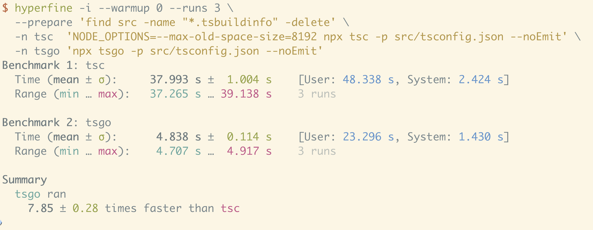

# tsgo : 10x plus rapide, mais à quel prix ?

<div class="muted">TypeScript 7, le port natif en Go (« Corsa »)</div>

<div class="stat-row">
  <BigStat from="78s" to="7.5s" label="vscode · type-check · benchmark officiel Microsoft" />
</div>
<!-- source: https://devblogs.microsoft.com/typescript/typescript-native-port/ -->

<div class="rule"></div>

Beta : **21 avril 2026** · stable visé Q2 2026
<!-- source: https://devblogs.microsoft.com/typescript/announcing-typescript-7-0-beta/ -->

Lilian Saget-Lethias · LinkedIn `lsagetlethias`

<div class="ai-credit">Présentation préparée en collaboration avec Claude Code (Opus 4.8).</div>

<!--
Hook, pas d'intro perso longue. Le titre EST l'accroche.
- tsgo = binaire. Corsa = codename. TS 7 = nom produit.
- 78s -> 7,5s = vscode (1,5M lignes), bench officiel Microsoft.
- Beta 21 avr 2026, stable visé Q2 2026.
- 1/3 promesse, 2/3 prix : annoncer l'arc en une phrase.
- Crédit Claude Code : une phrase factuelle, puis next.
-->

---
layout: code
file: tsgo.md
---

## C'est quoi tsgo ?

- **Port natif en Go** de `tsc` (codename **Corsa**), futur **TypeScript 7**
- Installé via `@typescript/native-preview`, binaire `tsgo`
- **Strada** (tsc en TS, depuis 2012) devient **Corsa** (tsgo, natif Go)
- Pas un `.js` : binaire natif **résolu par plateforme** (`optionalDependencies` par OS/arch)
<div class="src">source : npm @typescript/native-preview · Microsoft DevBlogs</div>
<!-- source: https://www.npmjs.com/package/@typescript/native-preview -->
<!-- source: https://devblogs.microsoft.com/typescript/typescript-native-port/ -->

<div class="muted small">Pas un « bootstrap » : tsgo est écrit en Go, il ne se compile pas lui-même.</div>

<!--
- Strada = ancien tsc en TS. Corsa = tsgo natif Go. Accoler les deux les 2 premières fois.
- native-preview = launcher npm + binaire par plateforme.
- Nuance distribution : pas un drop-in pur (optionalDependencies -win32-x64, -darwin-arm64...).
- Question CI multi-OS / airgapped / Yarn PnP : c'est le revers du « binaire en plus ».
-->

---
layout: code
file: benchmarks.md
---

## La promesse : ~10x, mémoire ÷2

- **vscode** (1,5M lignes) : `78s → 7.5s` <span class="muted">(~10x)</span>
- **Sentry** `133s → 16s` · **Playwright** `11.1s → 1.1s` <span class="muted">(même ordre de grandeur)</span>
- Type-check **~10x**, mémoire **~÷2**
- **Mêmes erreurs que `tsc`** : ~99% de résultats identiques <span class="muted">(74 cas qui divergent sur ~20 000 tests, déc 2025)</span>
<div class="src">source : Microsoft DevBlogs (port natif ; progress déc. 2025)</div>
<!-- source: https://devblogs.microsoft.com/typescript/typescript-native-port/ -->
<!-- source: https://devblogs.microsoft.com/typescript/progress-on-typescript-7-december-2025/ -->

<!--
- Ancrer UN chiffre : 78 -> 7,5 sur vscode, officiel Microsoft.
- Sentry / Playwright = confirmation, survol, pas une liste à cocher.
- Mémoire ÷2 = ce qui débloque la CI qui OOM aujourd'hui.
- Parité = tsgo trouve-t-il les mêmes erreurs que tsc sur le même code ? Diagnostic = un message du compilo (erreur / avertissement).
- 74 cas qui divergent / ~20 000 tests = ~99% identiques. Chiffre déc 2025 (avant beta), le dire DATÉ, ne pas le sortir en %.
-->

---
layout: code
file: avantages.ts
---

## Les gains

- **Vitesse** : la boucle de type-check passe de la minute à la seconde
- **Mémoire** : type-checke vscode là où `tsc` réclame 8 Go de heap (sinon OOM)
- **LSP natif dans le binaire** : plus de process Node `tsserver` à côté
- Le **10x** sert surtout l'outil, **agent IA inclus**, qui type-checke 40 fois par minute
<div class="src">source : Microsoft DevBlogs (« enable the next generation of AI tools »)</div>
<!-- source: https://devblogs.microsoft.com/typescript/typescript-native-port/ -->

<!--
- LSP natif = avantage ICI (vitesse, plus de process Node). Sa face B (refactos, plugins) vient en partie 2.
- AI-native = teaser, rebouclé en clôture. Ne pas griller le twist maintenant.
- Le 10x n'est pas pour le dev qui check une fois : il est pour la boucle automatisée.
-->

---
layout: center
---

<div class="divider-kicker">À QUEL PRIX ?</div>

# <span class="no-comment">Migration vs écosystème</span>

<div class="muted">Un grand pouvoir implique de grandes responsabilités.</div>

<!--
- Charnière. Le gain est vu, place aux contreparties.
- Thèse : 2 natures de prix. Migration = payable une fois. Écosystème = tooling pas encore rattrapé.
- Fil rouge unique = side-by-side : typescript@6 + native-preview, sanctionné par Microsoft.
- Annoncer qu'on débunke aussi des objections au passage (munitions Q&A).
- Cinq prix au total, lâchés un par un. Traverser cette slide, ne pas s'installer.
-->

---
layout: code
file: tsconfig.json
---

## Prix n°1 · La migration tsconfig

- `baseUrl` retiré (**TS5102**) : le cas le plus fréquent, les alias de monorepo sont partout
- `esModuleInterop: false` / `allowSyntheticDefaultImports: false` retirés (**TS5108**)
- **strict par défaut** + défauts silencieux (`types: ['*'] → []`, `module: esnext`) : ça casse **sans** message clair
- Aussi retirés : `out` / `outFile`, `target: es5`, `moduleResolution: node10`
- Effet domino en monorepo : sur **Gutenberg** (l'éditeur de WordPress), une ligne du `tsconfig` partagé casse **~84 packages** d'un coup
- Fix : codemod **`npx @andrewbranch/ts5to6`** ; `tsc` 6.x flague déjà en dépréciation
<div class="src">source : announce TS 7.0 beta · gutenberg#76148 · TS#63293</div>
<!-- source: https://devblogs.microsoft.com/typescript/announcing-typescript-7-0-beta/ -->
<!-- source: https://github.com/WordPress/gutenberg/issues/76148 -->
<!-- source: https://github.com/microsoft/TypeScript/issues/63293 -->

<div class="muted small">Débunk : tsgo n'interdit pas `const enum`, c'est le flag opt-in `erasableSyntaxOnly` (TS1294).</div>

<!--
- TS5102 = baseUrl removed. TS5108 = esModuleInterop removed. Codes voisins côté tsc (TS5101 / TS5107).
- Défauts silencieux = le vrai piège, pas de TS5xxx, ça casse sourdement.
- strict by default = gros poste pour un legacy non-strict (vague de strictNullChecks / noImplicitAny).
- ts5to6 = codemod officiel (@andrewbranch, équipe TS) : --fixBaseUrl, --fixRootDir.
- baseUrl : souvent mécanique, PARFOIS non-trivial en cross-package (#1713, nx#35272).
- Autre cas réel : tldraw a migré (PR ~47 fichiers, ~3 semaines).
- Take-away : un PR planifié d'une après-midi, automatisable, payable une fois.
-->

---
layout: code
file: why-api.go
---

## Prix n°2 · L'API a changé (Strada → Corsa)

- L'API du package `typescript` (`ts.createProgram`, `createLanguageService`, transformers) : **réécrite**
- Raison **structurelle**, pas un bug temporaire : on ne charge pas du JS tiers dans un binaire Go
- Remplacement : une API **IPC** (Inter-Process Communication), forme nouvelle, encore sous `./unstable/*`
- **Pas d'API stable avant 7.1**, plusieurs mois après la beta : le **7.0 stable ship sans**

<div class="ai-credit">Jake Bailey : « we can't actually load random code into a Go binary like we did a JS process. »</div>
<div class="src">source : typescript-go#455 · progress déc. 2025 · announce TS 7.0 beta</div>
<!-- source: https://github.com/microsoft/typescript-go/discussions/455 -->
<!-- source: https://devblogs.microsoft.com/typescript/progress-on-typescript-7-december-2025/ -->
<!-- source: https://devblogs.microsoft.com/typescript/announcing-typescript-7-0-beta/ -->

<!--
- Strada = tsc JS, API in-process. Corsa = binaire Go, pas de module JS à charger ni patcher.
- IPC = Inter-Process Communication : les deux process se parlent par messages (JSON-RPC / msgpack sur stdio), async-first.
- libsyncrpc = bridge synchrone (module natif Rust/NAPI), pas sur npm sous ce nom.
- 7.1 = API stable, pas avant. C'est le POURQUOI, le QUI casse vient à la slide suivante.
-->

---
layout: code
file: tooling.ts
---

## Qui casse, et pour qui

- **Consommateurs d'API** (ts-jest, ts-loader, ts-morph, TypeDoc, GraphQL Codegen) : `TypeError: ts.createProgram is not a function`
- **Transformers / monkeypatch** (ts-patch, ttypescript, typia) : bloqués *by construction*, pas de chemin tsgo
- **Typed-lint** : `typescript-eslint` attend l'API 7.1 ; **oxlint** (via tsgo) et **Biome** (moteur maison) n'ont pas ce prix
- À distinguer : pour qui **écrit** un de ces outils, c'est bloquant jusqu'à 7.1 ; pour une **app** qui ne fait que les utiliser, c'est juste de la config
- Solution : side-by-side, `typescript@6` pour les outils, `tsgo` pour le type-check rapide
<div class="src">source : typescript-go#516 · typescript-eslint#10940</div>
<!-- source: https://github.com/microsoft/typescript-go/issues/516 -->
<!-- source: https://github.com/typescript-eslint/typescript-eslint/issues/10940 -->

<!--
- Alias typescript -> native-preview : casse tout ce qui appelle l'API in-process. D'où le TypeError.
- by construction = on ne monkeypatch pas un binaire Go (ts-patch / ttypescript morts pour ce cas).
- Biome / oxlint NE sont PAS dans le cas de typescript-eslint : Biome a son propre moteur de types (scan des .d.ts, sans le compilo TS) ; oxlint passe par tsgolint, un wrapper sur tsgo (Go), alpha déc 2025, 59/61 règles, ~10x plus rapide qu'eslint+typescript-eslint.
- Le prix typed-lint est donc scopé à typescript-eslint, qui attend l'API stable (7.1). L'API JS de tsgo sera SYNCHRONE (pas WASM).
- Distinction à marteler : écrire un outil (bloqué) vs utiliser un outil dans une app (juste de la config).
- side-by-side = alias typescript@npm:@typescript/typescript6 + native-preview.
-->

---
layout: code
file: editor.ts
---

## Prix n°3 · Le LSP natif, face B

- Le même LSP natif vendu en avantage a des **trous fonctionnels**
- Refactos manquantes (Move to file en *Post-7.0*) ; support plus complet sur **VS Code** que sur **Visual Studio**
- **Plugins de frameworks morts** par design : Vue/Volar, Angular, Svelte, Astro
- Vue #5381 : **328 réactions**, OPEN ; l'API de remplacement est encore en conception
- Réversible : sur **VS Code**, `typescript.experimental.useTsgo` est un simple toggle (on garde `tsserver` dans l'éditeur, tsgo en CLI/CI)
<div class="src">source : vuejs/language-tools#5381 · typescript-go#2824</div>
<!-- source: https://github.com/vuejs/language-tools/issues/5381 -->
<!-- source: https://github.com/microsoft/typescript-go/issues/2824 -->

<!--
- Double tranchant : avantage (vitesse, pas de Node) en partie A, COÛT (refactos, plugins) ici.
- Plugins frameworks = pas supportés par le LS natif, by design. API IPC de remplacement = #2824 (Post-7.0).
- useTsgo = flag experimental : vérifier le nom exact le jour J (les settings dérivent).
- Débunk : codeActionsOnSave / Organize Imports cassés = bugs RÉELS mais corrigés à la beta, pas un prix actuel.
-->

---
layout: code
file: ci.yml
---

## Prix n°4 · Quand il faut encore garder tsc

```yaml
jobs:
  typecheck-fast:        # gate de PR : tsgo, rapide
    - run: tsgo --noEmit
  emit-declarations:     # artifact : tsc, source de vérité pour le .d.ts JS
    - run: tsc --emitDeclarationOnly
```

<div class="rule"></div>

- Pour du `.ts` pur, tsgo émet les `.d.ts` lui-même : pas besoin de `tsc`
- Mais pour publier des types issus de **JS / JSDoc / CommonJS**, on garde **`tsc`** à l'emit
- En CI, les caches incrémentaux de `tsc` et `tsgo` **ne se partagent pas** : deux caches à gérer
- Et le job qui émet reste à vitesse `tsc` : la PR gagne le 10x, pas l'étape de publication
<div class="src">source : README typescript-go · typescript-go#1146</div>
<!-- source: https://github.com/microsoft/typescript-go -->
<!-- source: https://github.com/microsoft/typescript-go/discussions/1146 -->

<!--
- declaration emit / JS emit / build mode / project refs / incremental = done côté tsgo (README).
- tsc reste nécessaire seulement pour émettre les types des libs JS/JSDoc/CJS.
- #1146 = caches .tsbuildinfo PAS partagés entre tsc et tsgo (chacun a son incremental).
- Le job emit reste à vitesse tsc : la PR gagne le 10x, pas l'étape de publication.
- Prix borné qui se referme : pour du .ts pur, plus besoin du double-binaire.
-->

---
layout: code
file: legacy.js
---

## Prix n°5 · Le seul sans filet : JSDoc au type-check

- Les patterns **JSDoc historiques** retirés cassent **au type-check**, pas qu'à l'emit
- **Pas** contournable en side-by-side : ça se paie en **réécriture du source**
- Toujours **Gutenberg** : `@typedef` / `@template` non résolus, cascade `TS2339` / `TS7006` / `TS4023` chez tous ceux qui consomment l'API
- Le plus douloureux pour **une** codebase **JS + JSDoc legacy** (utils internes, vieux packages)
<div class="src">source : gutenberg#76148 · typescript-go (declaration emit)</div>
<!-- source: https://github.com/WordPress/gutenberg/issues/76148 -->
<!-- source: https://github.com/microsoft/typescript-go/issues/2533 -->

<div class="muted small">Tous les autres prix ont un filet side-by-side. Celui-ci, non : il se paie en code.</div>

<!--
- Le SEUL prix de l'inventaire sans échappatoire side-by-side.
- Cible : JS + JSDoc legacy (utils internes, anciens packages npm). Public Paris TypeScript = concerné.
- @typedef / @template non résolus -> StoreDescriptor<C> perdu -> cascade chez les consumers de l'API publique.
- Leçon : l'emit de déclarations (surtout depuis JS/CJS) reste la surface la plus risquée. Bugs CJS reconnus (#2533, Hejlsberg).
-->

---
layout: code
file: bench.sh
---

## Le 10x n'est pas universel

- C'est le **temps de type-check** (multi-cœurs), pas le temps total de la CI
- Mémoire **÷2 sur un cœur**, mais elle remonte en parallèle (790 → 1321 Mo)
- Petit projet **~3,5x**, gros repo **~8x** : le gain dépend du repo



<div class="src">mesure hyperfine maison sur vscode (ce M2) : tsc ~38s, tsgo ~4,8s, ~7,8x · zackoverflow.dev · bench Medium</div>
<!-- source: https://zackoverflow.dev/writing/why-does-tsgo-use-so-much-memory -->

<!--
- 10x = temps de type-check sur plusieurs cœurs, pas le pipeline complet (l'emit reste à vitesse tsc).
- Mémoire : ÷2 sur un cœur, mais remonte en parallèle (chaque thread duplique les symboles).
- Screenshot = mesure maison hyperfine sur vscode (~7,8x sur ce M2, Microsoft annonce ~10x). Mesure réelle.
- Petit projet ~3,5x, runner mono-cœur ~28% : le 10x n'est pas garanti, mesurer son repo.
- Débunk : la régression NestJS (Twenty CRM #2551) est CORRIGÉE (#2567), ne pas la citer comme prix vivant.
- Tremplin vers le climax « le vrai gain ».
-->

---
layout: code
file: ai-native.ts
---

## Le vrai gain : l'ère AI-native

- Le **10x** n'est pas pour le dev qui check une fois ; il est pour **l'agent qui type-checke 40 fois par minute**
- Sur les cinq prix : **quatre** se règlent en **side-by-side**, le cinquième (JSDoc) en réécriture ; la moitié se referme à la **RC**
- Nuance : le side-by-side n'est pas gratuit (deux versions de TS à tenir jusqu'à 7.1)

<div class="ai-credit">Microsoft : « …enable the next generation of AI tools to enhance development. »</div>
<div class="src">source : Microsoft DevBlogs · typescript-go/milestone/1 (RC à 76% au 8 juin)</div>
<!-- source: https://devblogs.microsoft.com/typescript/typescript-native-port/ -->
<!-- source: https://github.com/microsoft/typescript-go/milestone/1 -->

<!--
- Climax = rebouclage AI-native (teasé en slide « Les gains »). Lire le twist FORT, lentement.
- Citation MS = objectif affiché, pas une interprétation perso.
- Les prix sont payables en side-by-side ; la moitié (emit, certains tooling) se referme à la RC.
- Coût mental du side-by-side = touche honnête : dette opérationnelle continue, pas un one-time.
- RC ouvert à 76% au 8 juin : Q2 sous tension mais crédible. Vérifier le statut le jour J.
-->

---
layout: center
class: cover
---

# <span class="no-comment">10x, oui. Le prix : raisonnable.</span>

<div class="muted">Cinq prix : quatre se règlent en side-by-side, le cinquième en réécriture. La moitié se referme à la RC.</div>

<div class="rule"></div>

Lilian Saget-Lethias · LinkedIn `lsagetlethias`

<div class="muted small">Slides & sources : <code>github.com/lsagetlethias/tsgo-parists-20260609</code></div>

<div class="ai-credit">Préparé en collaboration avec Claude Code (Opus 4.8).</div>

<!--
- Sign-off + support Q&A. Reste affichée pendant les questions.
- Résumé : 5 prix (migration, API, LSP face B, garder-tsc, JSDoc). 4 en side-by-side, JSDoc en réécriture. Moitié se referme RC.

MUNITIONS Q&A (débunks vérifiés) :
- const enum : pas interdit, c'est erasableSyntaxOnly (opt-in, TS1294).
- emit .d.ts : declaration / build mode / project refs / incremental = done. Preview = périmé.
- Faux positifs / faux négatifs cités en ligne : corrigés avant beta ou changements intentionnels TS5.9.
- watch : prototype non optimisé, pas inerte. nodemon + tsgo --incremental en attendant.
- incremental done MAIS cache pas partagé tsc <-> tsgo (#1146).
- drop-in : nuance, binaire natif résolu par plateforme (optionalDependencies).
- « 9/15 » : source unique Medium -> dire « la majorité des outils qui touchent l'API ».
- « 74 diagnostics » : chiffre déc 2025, dire « ~99%, daté ».

REPÈRES : beta 21 avr 2026, stable visé Q2 2026, API stable 7.1. Pas de @mention en commentaire de repo.
-->
