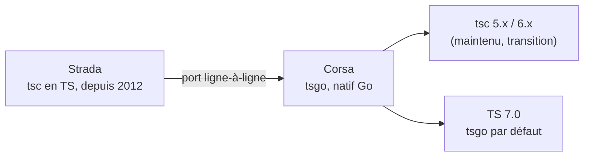

# tsgo : 10x plus rapide, mais à quel prix ?

<div class="muted">TypeScript 7, le port natif en Go (« Corsa »)</div>

<div class="stat-row">
  <BigStat from="78s" to="7.5s" label="vscode · type-check (benchmark officiel)" />
</div>
<!-- source: https://devblogs.microsoft.com/typescript/typescript-native-port/ -->

<div class="rule"></div>

Beta : **21 avril 2026** · stable visé Q2 2026
<!-- source: https://devblogs.microsoft.com/typescript/announcing-typescript-7-0-beta/ -->

Lilian Saget-Lethias · LinkedIn `lsagetlethias`

<div class="ai-credit">Présentation préparée en collaboration avec Claude Code (Opus 4.8).</div>

---
layout: code
file: benchmarks.md
---

## Les chiffres qui font le buzz

- **vscode** (1.5M lignes) : `78s → 7.5s` <span class="muted">(~10x)</span>
- **Sentry** `133s → 16s` · **Playwright** `11.1s → 1.1s` <span class="muted">(même ordre de grandeur)</span>
<!-- source: https://devblogs.microsoft.com/typescript/typescript-native-port/ -->

<div class="rule"></div>

- Type-check **~10x**, mémoire **~÷2**
<!-- source: https://devblogs.microsoft.com/typescript/typescript-native-port/ -->

<div class="muted small">Et c'est correct : 74 diagnostics divergents sur ~20 000 cas de test.</div>
<!-- source: https://devblogs.microsoft.com/typescript/progress-on-typescript-7-december-2025/ -->

---
layout: center
---

<div class="divider-kicker">LE GAIN · LA VITESSE</div>

# <span class="no-comment">Le mur de la compilation</span>

<div class="muted"><code>time tsc --noEmit</code> &nbsp;vs&nbsp; <code>time tsgo --noEmit</code> &nbsp;·&nbsp; microsoft/vscode</div>

---
layout: code
file: why-go.go
---

## Pourquoi Go, et pas Rust ?

Un compilateur, c'est un gros graphe d'objets qui se pointent mutuellement : un nœud connaît son parent ET ses enfants.

- Port quasi **ligne-à-ligne** du tsc existant : le codebase s'y prête
- Go gère ces **graphes cycliques** nativement (GC) ; le **borrow-checker** de Rust, lui, frictionne
- L'auteur de **SWC** a exploré un tsc en Rust, puis l'a écarté
<!-- source: https://devblogs.microsoft.com/typescript/typescript-native-port/ -->

<div class="muted small">Pas un « bootstrap » (compilo écrit dans son propre langage) : tsgo est en Go, il ne se compile pas lui-même.</div>

---
layout: code
file: corsa.mmd
---

## Strada → Corsa



<div class="muted small">Strada = le tsc actuel (TS, depuis 2012). Corsa = le port natif en Go, c'est tsgo.</div>

---
layout: center
---

<div class="divider-kicker">À QUEL PRIX ?</div>

# <span class="no-comment">Ça, c'était la vitesse.</span>

<div class="muted">Maintenant, les trois additions : migration, double-binaire, tooling.</div>

---
layout: center
---

<div class="divider-kicker">PRIX n°1 · LA MIGRATION</div>

# <span class="no-comment">Migrer un vrai projet</span>

<div class="muted">monorepo pnpm · <code>esModuleInterop</code> · <code>baseUrl</code> · <code>const enum</code></div>

---
layout: code
file: typecheck.yml
---

## Prix n°2 · CI : le double-binaire

```yaml
jobs:
  typecheck-fast:           # gate de PR : tsgo, ~10x plus rapide
    steps:
      - run: pnpm typecheck:tsgo      # tsgo --noEmit

  emit-declarations:        # artifact fiable : tsc produit les .d.ts
    steps:
      - run: pnpm build:declarations  # tsc --emitDeclarationOnly
```

<div class="rule"></div>

**Pourquoi deux jobs ?** (1) l'emit `.d.ts` de tsgo est encore en preview ;
(2) l'API que consomment les outils a changé entre Strada et Corsa. On type-checke
vite avec tsgo, on **émet** les `.d.ts` avec tsc, la source de vérité.

---
layout: code
file: tooling.ts
---

## Prix n°3 · AI tooling & LSP

- `tsgo --lsp` : un **serveur LSP natif** dans le binaire (Zed, Helix, Effect s'y branchent)
- **Coût** : l'API Strada (linters, outils) est cassée dans Corsa, remplacement stable visé **7.x** (annoncé 7.1)
- Sur 15 outils TS testés publiquement, **9 demandent un setup side-by-side**
<!-- source: https://thinkingthroughcode.medium.com/i-tested-15-popular-libaries-with-typescript-7-toolchain-heres-how-to-fix-broken-migration-7ea719018e6d -->

<div class="rule"></div>

Le **10x** n'est pas pour toi qui type-checkes une fois ; il est pour l'outil
(agent IA inclus) qui type-checke 40 fois par minute.

<div class="ai-credit">Microsoft : « …enable the next generation of AI tools to enhance development. »</div>
<!-- source: https://devblogs.microsoft.com/typescript/typescript-native-port/ -->

---
layout: code
file: lundi.sh
---

## Lundi, 3 actions

1. **Mesure ton chiffre.** Sur ton plus gros repo :
   `pnpm add -D @typescript/native-preview` puis `tsgo --noEmit`.
2. **Ajoute la gate CI.** Job `typecheck-fast` avec tsgo ;
   garde `tsc --emitDeclarationOnly` pour les `.d.ts`.
3. **Audite ta dette.** `grep` tes tsconfig : `baseUrl`,
   `esModuleInterop: false`, `const enum`, `node10`.

<div class="rule"></div>

<div class="muted">Trois prix, tous payables aujourd'hui en side-by-side. tsgo ne te sauve pas de ta dette de config ; il la révèle, juste 10x plus vite.</div>

---
layout: center
---

<div class="divider-kicker">APPENDICE</div>

# <span class="no-comment">Plan B</span>

<div class="muted">Slides de secours si une démo se plante. Sauter en temps normal.</div>

---
layout: code
file: backup-demo1.txt
---

## Plan B · Démo 1 (sorties attendues)

```text
$ time tsc  -p src/tsconfig.json --noEmit
real    1m18.4s          # ~78s, cold

$ time tsgo -p src/tsconfig.json --noEmit
real    0m7.6s           # ~7.5s, ~10x
```
<!-- source: https://devblogs.microsoft.com/typescript/typescript-native-port/ -->

<div class="muted small">Annonce les chiffres comme TES mesures sur scène, pas comme le benchmark MS.</div>

---
layout: code
file: backup-demo2.txt
---

## Plan B · Démo 2 (gotchas, sorties attendues)

```text
$ tsgo -p gotchas/esModuleInterop-removed.tsconfig.json
error TS5108: Option 'esModuleInterop=false' has been removed.

$ tsgo -p gotchas/baseUrl-removed.tsconfig.json
error TS5102: Option 'baseUrl' has been removed.

$ tsgo -p gotchas/tsconfig.json
error TS1294: This syntax is not allowed when 'erasableSyntaxOnly' is enabled.
```

<div class="muted small">Même problème détecté par tsc et tsgo (codes voisins : tsc rend TS5107 / TS5101), réponse quasi instantanée.</div>
